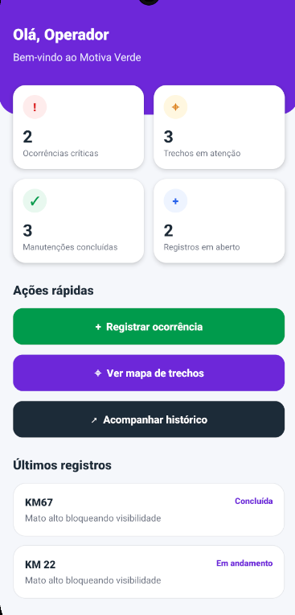
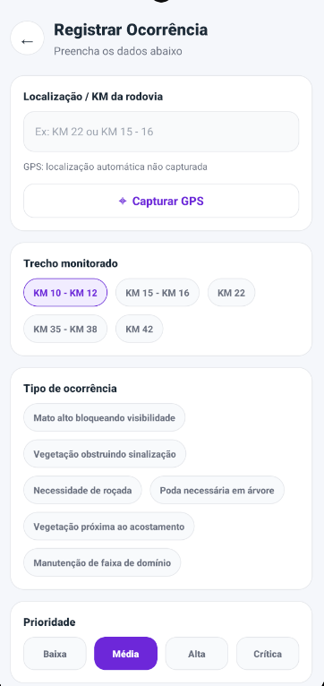
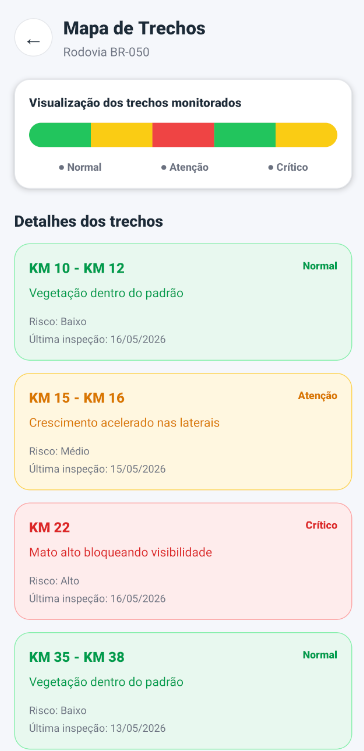
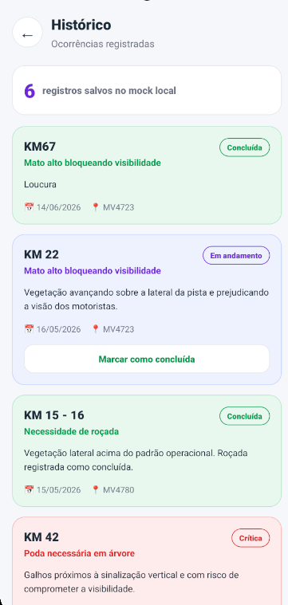

# Motiva Verde - Sprint 2

Aplicativo mobile desenvolvido em **React Native com Expo** para o Challenge CCR Motiva, com foco no **registro e acompanhamento de ocorrências de vegetação em trechos de rodovia**.

Nesta Sprint, o projeto evolui do protótipo navegável da Sprint 1 para um app funcional, utilizando **dados mockados** para simular o comportamento real da aplicação, sem dependência de APIs externas.

---

## Integrantes

| Nome                        | RM     |
| --------------------------- | ------ |
| Fernando Caires Silva       | 563415 |
| Giovanna Fernandes Pereira  | 565434 |
| Guilherme Martins Rezende   | 563500 |
| João Pedro de Moura Albino  | 565323 |
| Kauê Silva Matheus          | 561675 |
| Raphael Mischiatti de Souza | 563567 |

---

## Links do Projeto

**Repositório GitHub:**
https://github.com/jalbino0/challenge-motiva-verde-sprint2.git

**Vídeo de demonstração:**
https://youtube.com/shorts/7cqD1AZ7iVg?feature=share

**Protótipo da Sprint 1 no Figma:**
https://www.figma.com/make/1NaP87mmIRBySLItqw7qig/Motiva-Verde-App-Prototype?code-node-id=0-9&p=f&t=k5vQmjbg0GrPwI3O-0&fullscreen=1

---

## Contexto do Projeto

A Motiva atua na gestão e conservação de rodovias, incluindo atividades como roçada, manutenção de faixas de domínio e acompanhamento das condições da vegetação ao longo dos trechos concedidos.

O problema trabalhado neste projeto é a dificuldade de registrar, acompanhar e priorizar ocorrências relacionadas à vegetação, como:

* mato alto bloqueando visibilidade;
* vegetação obstruindo sinalização;
* necessidade de roçada;
* poda preventiva;
* manutenção da faixa de domínio.

O aplicativo **Motiva Verde** busca apoiar o operador de campo no registro dessas ocorrências, permitindo que os dados sejam visualizados posteriormente em um histórico e em um mapa de trechos monitorados.

---

## Objetivo da Sprint 2

O objetivo desta Sprint é desenvolver uma versão funcional do aplicativo mobile com:

* navegação entre telas;
* dados mockados realistas;
* fluxo completo de registro de ocorrência;
* atualização do estado da interface após uma ação do usuário;
* uso de recursos nativos do dispositivo, como GPS e galeria/câmera;
* consistência visual com o protótipo criado na Sprint 1.

---

## Telas do Aplicativo

As telas abaixo mostram a versão funcional do app desenvolvida na Sprint 2, seguindo o protótipo da Sprint 1 e utilizando dados mockados.

<div align="center">

<table>
  <tr>
    <td align="center">
      <strong>Entrada do Operador</strong><br/>
      
    </td>
    <td align="center">
      <strong>Dashboard</strong><br/>
      
    </td>
    <td align="center">
      <strong>Registrar Ocorrência</strong><br/>
      
    </td>
  </tr>
  <tr>
    <td align="center">
      <strong>Mapa de Trechos</strong><br/>
      
    </td>
    <td align="center">
      <strong>Histórico</strong><br/>
      
    </td>
  </tr>
</table>

</div>

---

## Funcionalidades Implementadas

### Acesso como operador

O app possui entrada direta como **Operador de Campo**, sem autenticação real.

Essa decisão foi tomada porque a Sprint 2 tem como foco a validação dos fluxos principais com dados mockados. A autenticação poderá ser integrada em uma etapa futura com API real.

---

### Dashboard do Operador

O dashboard apresenta indicadores simulados da operação:

* ocorrências críticas;
* trechos em atenção;
* manutenções concluídas;
* registros em aberto;
* últimos registros cadastrados.

Os números são calculados com base nos dados mockados e nas ocorrências criadas durante o uso do app.

---

### Registro de Ocorrência

O operador pode registrar uma nova ocorrência informando:

* KM ou trecho da rodovia;
* trecho monitorado;
* tipo de ocorrência;
* prioridade;
* altura estimada da vegetação;
* descrição da situação;
* localização via GPS;
* imagem pela câmera ou galeria.

Ao salvar, a ocorrência é adicionada ao histórico e os dados do dashboard são atualizados.

---

### Histórico de Ocorrências

A tela de histórico exibe todas as ocorrências registradas, incluindo os dados iniciais do mock e os novos registros feitos pelo operador.

Também é possível marcar uma ocorrência como concluída, simulando a atualização de status de uma intervenção.

---

### Mapa de Trechos

A tela de mapa apresenta uma visualização simplificada dos trechos monitorados da rodovia, separados por status:

* Normal;
* Atenção;
* Crítico.

Cada trecho possui informações como KM, descrição, risco e data da última inspeção.

---

## Fluxo Principal do App

O fluxo principal implementado é:

```txt
Entrar como operador
↓
Acessar o dashboard
↓
Registrar uma nova ocorrência
↓
Salvar os dados no mock local
↓
Visualizar a ocorrência no histórico
↓
Ver o dashboard atualizado
```

Esse fluxo demonstra que o aplicativo não é apenas visual, mas possui navegação funcional, manipulação de estado e resposta da interface após uma ação do usuário.

---

## Mocks Utilizados

Os dados mockados estão localizados no arquivo:

```txt
src/data/mockData.ts
```

O mock representa cenários relacionados ao contexto da Motiva, incluindo trechos monitorados, ocorrências, status da vegetação e registros de inspeção.

---

### Trechos Monitorados

Cada trecho possui:

* identificador;
* KM;
* nome do trecho;
* rodovia;
* cidade;
* status da vegetação;
* nível de risco;
* data da última inspeção;
* código operacional.

Exemplos de status utilizados:

```txt
Normal
Atenção
Crítico
```

---

### Ocorrências

Cada ocorrência possui:

* identificador;
* KM;
* trecho;
* rodovia;
* cidade;
* tipo de ocorrência;
* prioridade;
* status;
* descrição;
* altura estimada;
* data de criação;
* responsável operacional;
* localização;
* foto anexada, quando houver.

---

### Persistência Local

Além do mock inicial, o app utiliza **AsyncStorage** para manter os registros criados durante o uso do aplicativo.

Dessa forma, uma nova ocorrência cadastrada pelo operador continua aparecendo no histórico enquanto os dados locais não forem restaurados.

---

## Recursos Nativos Utilizados

O projeto utiliza recursos nativos do dispositivo por meio do Expo:

* **GPS:** captura da localização atual do operador;
* **Câmera:** registro de imagem da ocorrência;
* **Galeria:** seleção de imagem já existente no dispositivo;
* **Armazenamento local:** persistência dos mocks com AsyncStorage.

---

## Tecnologias Utilizadas

* React Native
* Expo SDK 54
* Expo Router
* TypeScript
* AsyncStorage
* Expo Location
* Expo Image Picker
* React Native Safe Area Context
* StyleSheet

---

## Estrutura de Pastas

```txt
challenge-motiva-verde-sprint2/
│
├── app/
│   ├── _layout.tsx
│   ├── index.tsx
│   ├── dashboard.tsx
│   ├── registrar.tsx
│   ├── mapa.tsx
│   └── historico.tsx
│
├── assets/
│   ├── logo-simbolo.png
│   └── screens/
│       ├── entrada.png
│       ├── dashboard.png
│       ├── registrar.png
│       ├── mapa.png
│       └── historico.png
│
├── src/
│   ├── components/
│   │   ├── OccurrenceCard.tsx
│   │   ├── PrimaryButton.tsx
│   │   └── StatusCard.tsx
│   │
│   ├── context/
│   │   └── OccurrenceContext.tsx
│   │
│   ├── data/
│   │   └── mockData.ts
│   │
│   └── styles/
│       └── theme.ts
│
├── app.json
├── package.json
├── tsconfig.json
└── README.md
```

---

## Como Executar o Projeto

### 1. Clonar o repositório

```bash
git clone https://github.com/jalbino0/challenge-motiva-verde-sprint2.git
```

### 2. Entrar na pasta do projeto

```bash
cd challenge-motiva-verde-sprint2
```

### 3. Instalar as dependências

```bash
npm install
```

### 4. Instalar dependências compatíveis com o Expo

```bash
npx expo install react-native-safe-area-context expo-location expo-image-picker @react-native-async-storage/async-storage
```

### 5. Rodar o projeto

```bash
npx expo start -c
```

Depois, o app pode ser executado no:

* Expo Go em dispositivo físico;
* emulador Android;
* simulador iOS.

---

## Como Testar o Fluxo Principal

1. Abrir o app.
2. Clicar em **bem vindo de volta operador**.
3. Acessar o dashboard.
4. Clicar em **Registrar ocorrência**.
5. Preencher os dados da ocorrência.
6. Capturar GPS, se desejar.
7. Adicionar foto pela câmera ou galeria, se desejar.
8. Salvar a ocorrência.
9. Conferir o novo registro no histórico.
10. Voltar ao dashboard e verificar os indicadores atualizados.

---

## Vídeo de Demonstração

O vídeo de demonstração está disponível no YouTube:

https://youtube.com/shorts/7cqD1AZ7iVg?feature=share

No vídeo são demonstrados:

* entrada como operador;
* navegação entre telas;
* dashboard funcional;
* cadastro de ocorrência;
* uso dos mocks;
* histórico atualizado;
* mapa de trechos monitorados.

---

## Status do Projeto

Projeto desenvolvido para a **Sprint 2** do Challenge CCR Motiva.

A aplicação está funcional com dados mockados e preparada para futura integração com APIs reais nas próximas etapas do projeto.

---

## Observação

Esta versão não possui autenticação real nem integração com banco de dados externo. O uso de mock de dados é intencional nesta Sprint, com o objetivo de validar a experiência do usuário e o fluxo principal da solução.
